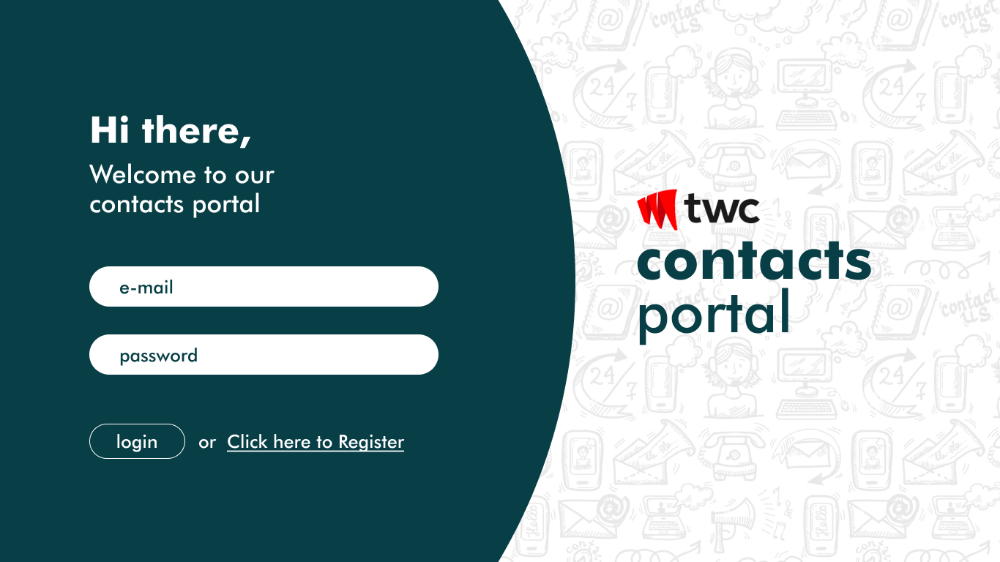

## TWC Assignment 📑

Hello, 
As we discussed on our quick chat, your next step will be to complete a task to test your knowledge of design, analytics, React and basics of a Rest api.
Your task will be to build a very basic full stack system. The initial screen will be a login page. Once the user signs in, they will be greeted with a welcome message and a button to add a “contact”. Once this button is clicked a form has to be filled to add a “contact”. A list of all “contacts” must be shown in a table along with the ability to edit and delete them. 

---

## Your Challenge - TWC CONTACTS PORTAL APP 🏆

Your challenge is to build out these UIs and get it looking as close to the design as possible.

- React.js must be used to build the UI components.
  
  - You need to use **NextJs** or **Vite** for creating a React App
  
  - For styling React Components use **Tailwindcss**
  
  - Don't use any component libraries like  MUI or Daisy UI or Bootstrap
  
  - This challenge focuses on **both mobile and a desktop design**, you won't receive any mobile UIs for this challenge you have try to make it responsive on mobile screens
    
    - hint: refer Responsive design [section](https://tailwindcss.com/docs/responsive-design) on Tailwindcss docs

- A REST API must be built using Node.js to carry out the business logic.
  
  - You need to use express.js or Nest.js for creating an api

- Use mongodb for saving user info, contacts or any database related things.    

- You will be given **5 days** to complete this task and you must strictly adhere to the UI design provided in the link below.

## React app pages and their routes 🛣️

| Routes        | Description            |
|:------------- |:---------------------- |
| /             | welcome page           |
| /register     | user registration page |
| /login        | user login page        |
| /contacts     | all contacts page      |
| /contacts/new | add a new contact page |

---

## Submitting your project 📬

- Create a public github repo with the name `twc-portal-web` for the React App and  `twc-portal-api` for the Node API and push your code.
- share both public github repositories and credentials before the end of the deadline

---

## Key Features for Making your App Stand Out 💡

- Implementing a social sign on(SSO) with google(refer the register page UI)

- Deploy both your React app and Express api in a cloud platform(Vercel, Heroku, DIgital Ocean or any platform you comfortable with)

- Add validation for inputs like email, phone number (you're free to add any kind of rules for your forms)

 <b> <h1> Have fun building! 🚀 </h1> </b> 

